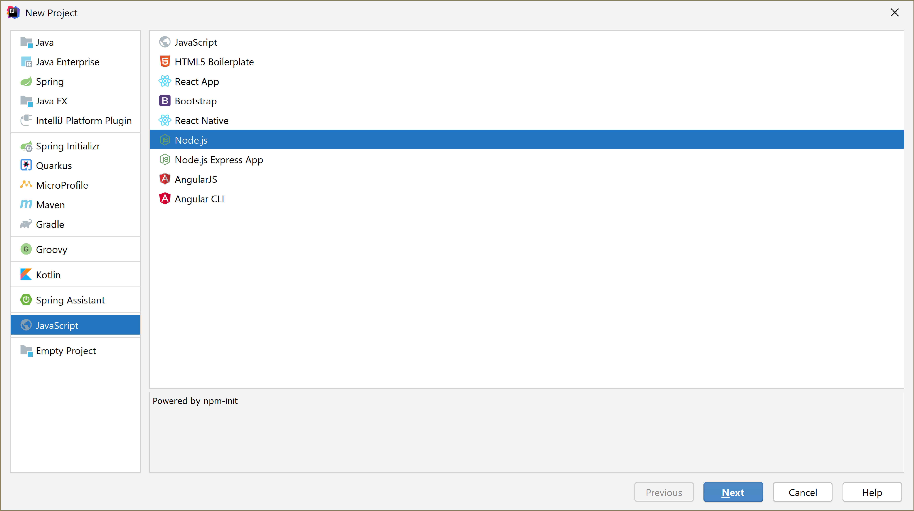
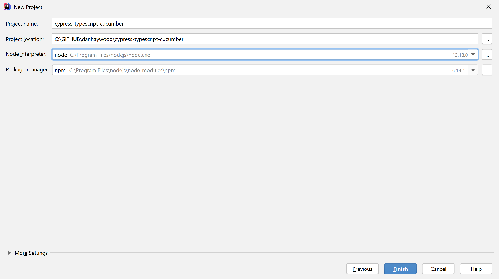

= README

== Setup IntelliJ Project

* New Project
+

* node.js project
+

== IntelliJ Plugins

Installed:

* Cucumber.js
* Run Configuration for Typescript
* Asciidoc

Built-in:

* Node.js

Disabled built-in:

* Cucumber for Java

== Project setup

Following link:https://fullstackhq.io/the-no-tears-cypress-setup/[fullstackhq.io/the-no-tears-cypress-setup] from Nov 2019:

* install cypress
+
[source,bash]
----
npm install -D cypress
----

* configured script in `package.json` to start cypress:
+
[source,json]
----
{
  "scripts": {
    "cypress:open": "npx cypress open"
  },
----

* setup typescript:
+
[source,bash]
----
npm install -D ts-loader @cypress/webpack-preprocessor @babel/core @babel/preset-env babel-loader webpack typescript
----

* setup webpack
+
[source,javascript]
.cypress/webpack.config.js
----
module.exports = {
    resolve: {
        extensions: [".ts", ".js"]
    },
    node: { fs: "empty", child_process: "empty", readline: "empty" },
    module: {
        rules: [
            {
                test: /\.ts$/,
                exclude: [/node_modules/],
                use: [
                    {
                        loader: "ts-loader"
                    }
                ]
            }
        ]
    }
};
----

* setup typescript config
+
[source,json]
.cypress/tsconfig.json
----
{
  "compilerOptions": {
    "strict": true,
    "baseUrl": "../node_modules",
    "target": "es5",
    "lib": ["es5", "dom"],
    "types": ["cypress"]
  },
  "include": [
    "**/*.ts"
  ]
}
----

* setup preprocessor:
+
[source,javascript]
.cypress/plugins/preprocess.js
----
const webpack = require('@cypress/webpack-preprocessor')

const options = {
    webpackOptions: require("../webpack.config.js")
};

module.exports = webpack(options)
----
+
and:
+
[source,javascript]
.cypress/plugins/index.js
----
const preprocess = require('./preprocess');

/**
 * @type {Cypress.PluginConfig}
 */
module.exports = (on, config) => {
    on("file:preprocessor", preprocess);

    const targetEnv = config.env.TARGET_ENV || 'qa';

    const environmentConfig = require(`./config/${targetEnv}`);

    return {
        ...config,
        ...environmentConfig,
    };
}
----

* setup environment configs
+
see original documentation ... `plugins/config/{local|qa|prod}.js`

* install cucumber support:
+
[source,bash]
----
npm install -D cypress-cucumber-preprocessor
----
+
* configure cypress:
+
[source,json]
.cypress.json
----
{
 "testFiles": "**/*.feature"
}
----
+
and
+
[source,json]
.package.json
----
"cypress-cucumber-preprocessor": {
  "nonGlobalStepDefinitions": true
}
----
+
and this rule:
+
[source,javascript,indent=0]
.cypress/webpack.config.js
----
{
    test: /\.feature$/,
    use: [
        {
            loader: "cypress-cucumber-preprocessor/loader"
        }
    ]
}
----

* create example `search.feature` and spec  (see article).

== gts config

* init
+
[source,bash]
----
npx gts init
----
